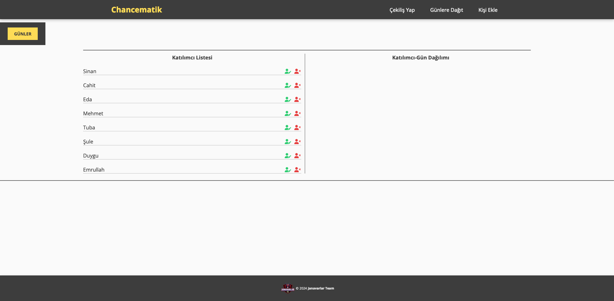

# Chancematik

Chancematik, rastgele çekilişler yapmak ve katılımcıları belirli günlerde görevleri dağıtmak için kullanılan bir web uygulamasıdır.

## Demo

Projenin canlı demo versiyonunu [buradan](https://dev-team01-techpro.github.io/js-chancematik/) inceleyebilirsiniz.



## İçindekiler

- [Giriş](#giriş)
- [Özellikler](#özellikler)
- [Katkıda Bulunanlar](#katkıda-bulunanlar)
- [Kullanım](#kullanım)
- [Kurulum](#kurulum)
- [Lisans](#lisans)

## Giriş

Chancematik, Janavarlar Takımı tarafından geliştirilmiş bir projedir. Katılımcılar arasında rastgele çekilişler yapmayı ve görevleri haftanın belirli günlerine göre dağıtmayı sağlayan kullanıcı dostu bir arayüz sunar.

## Özellikler

- **Çekiliş Yap:** Katılımcılar arasında rastgele bir çekiliş yapın.
- **Günlük Dağıtım:** Görevleri veya etkinlikleri seçilen günler bazında katılımcılar arasında dağıtın.
- **Katılımcı Yönetimi:** Katılımcıları kolayca ekleyin, düzenleyin ve silin.
- **Katkıda Bulunanlar:** Bu projeye katkıda bulunanları görüntüleyin ve onlara teşekkür edin.

## Katkıda Bulunanlar

Bu projeyi mümkün kılan aşağıdaki katkıda bulunanlara teşekkür ederiz:

- [Sinan Sarıkaya](https://github.com/sinansarikaya)
- [Mehmet Genç](https://github.com/MehmetGenc35)
- [Cahit Ata](https://github.com/Ata324)
- [Eda Sarıkaya](https://github.com/Edass)
- [Duygu Yılmaz](https://github.com/duyguyilmaz1)
- [Tuba Göçmek](https://github.com/tubagocmek)
- [Şule Demir](https://github.com/sulebdemir)
- [Emrullah Sağlam](https://github.com/ekhanemir)

## Kullanım

1. **Katılımcı Ekle:**

   - Navigasyon çubuğundan "Kişi Ekle" seçeneğine tıklayarak yeni katılımcılar ekleyin.
   - Katılımcının tam adını doldurun ve formu gönderin.

2. **Çekiliş Yap:**

   - Navigasyon çubuğundan "Çekiliş Yap" seçeneğine tıklayarak katılımcılar arasında rastgele çekiliş yapın.

3. **Günlük Dağıtım:**

   - Navigasyon çubuğundan "Günlere Dağıt" seçeneğine tıklayarak seçilen günler bazında görevleri veya etkinlikleri dağıtın.

4. **Katılımcıları Düzenle:**
   - Bir katılımcının adının yanındaki düzenle simgesine tıklayarak bilgilerini düzenleyin.

## Kurulum

1. Depoyu klonlayın:
   ```bash
   git clone https://github.com/your-username/chancematik.git
   ```
2. Proje dizinine girin:
   ```bash
   cd chancematik
   ```
3. Uygulamayı, index.html dosyasını bir web tarayıcısında açarak başlatın.

## Lisans

Bu proje [MIT Lisansı](./LICENSE) ile lisanslanmıştır.

Lütfen klon URL'sinde "your-username" bölümünü kendi GitHub kullanıcı adınızla değiştirin. Ayrıca, kullanım talimatlarını ve kurulum adımlarını ihtiyaca göre güncelleyin.
